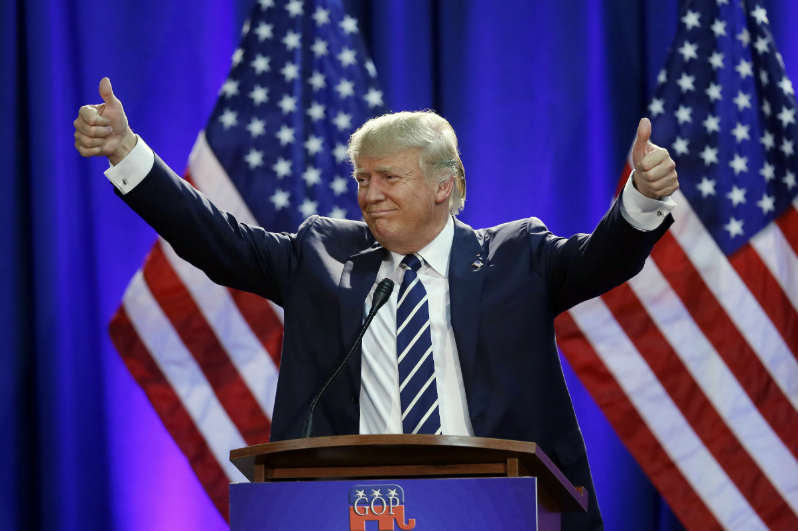

# Spring 2017
# Project 1: Prediting Donald Trump Inauguration Lyrics Using Big Data



### [Project Description](doc/)
This is the first and only *individual* (as opposed to *team*) this semester. 

Term: Spring 2017

+ Projec title: Prediting Donald Trump Inauguration Lyrics Using Big Data
+ This project is conducted by Chengcen Zhou
+ Project summary: Here I conduct a brief study of what did the president say at their inauguation. The data collects 59 Inaugurals. I focus on using past presidents' speeches to predict Donald Trump's Inaugural.

[See Report](file:///Users/Connie/Desktop/Spri2017-Proj1-Chengcen_Zhou.html)

[See code](https://github.com/TZstatsADS/Spr2017-Proj1-ChengcenZhou/blob/master/Spri2017-Proj1-Chengcen%20Zhou.Rmd)

Following [suggestions](http://nicercode.github.io/blog/2013-04-05-projects/) by [RICH FITZJOHN](http://nicercode.github.io/about/#Team) (@richfitz). This folder is orgarnized as follows.

```
proj/
├── lib/
├── data/
├── doc/
├── figs/
├── output/
├──Spri2017-Proj1-Chengcen Zhou.html/
└── Spri2017-Proj1-Chengcen Zhou.rmd/
```

Please see each subfolder for a README file.
